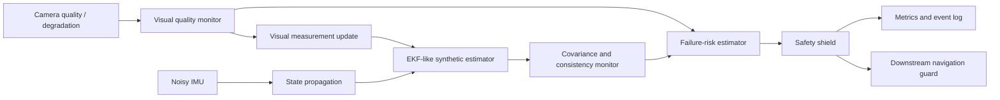
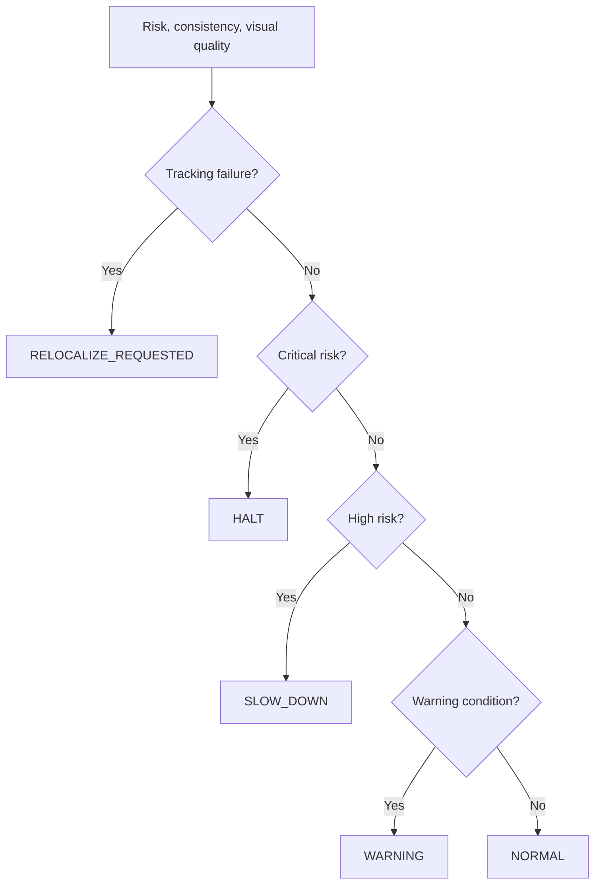

# SHIELD-VIO

<p align="center">
  <strong>Safety-aware visual–inertial odometry with uncertainty monitoring and failure shielding</strong><br/>
  A reproducible research prototype for detecting degraded state estimates before they propagate into unsafe navigation decisions.
</p>

<p align="center">
  <a href="https://github.com/panagiotagrosdouli/SHIELD-VIO/actions"></a>
  
  
  
  
</p>

> **Research question**  
> How can a visual–inertial estimator recognize that its state estimate is becoming unreliable and shield downstream autonomy before localization failure becomes safety critical?

## Research vision

Visual–inertial odometry is commonly evaluated through trajectory accuracy. For safety-critical autonomy, accuracy alone is insufficient: a navigation system must also know when the estimate should no longer be trusted.

SHIELD-VIO studies estimator introspection. It combines visual-quality diagnostics, innovation consistency, covariance health, trajectory-error indicators, normalized risk, and an interpretable safety shield that can warn, slow down, halt, or request relocalization.

<p align="center">
  
</p>

## Core research contributions

| Contribution | Description |
|---|---|
| Estimator introspection | Tracks uncertainty, NEES/NIS consistency, visual quality, and degradation indicators. |
| Failure-risk synthesis | Combines heterogeneous diagnostics into a normalized safety signal. |
| Explicit shielding policy | Converts estimator health into NORMAL, WARNING, SLOW_DOWN, HALT, or RELOCALIZE actions. |
| End-to-end synthetic pipeline | Generates trajectories, measurements, metrics, figures, GIF, and MP4 from code. |
| Claim-disciplined evaluation | Synthetic behavior is clearly separated from production VIO and real-dataset performance. |

## Safety architecture



## Scientific formulation

The nominal IMU-centric state is represented as

```math
x = \{p_{WI}, v_{WI}, q_{WI}, b_a, b_g\},
```

with a 15-dimensional error state

```math
\delta x = [\delta p,\delta v,\delta\theta,\delta b_a,\delta b_g]^T.
```

The executable demo currently uses a simplified translational EKF-like estimator. For innovation `ν` and innovation covariance `S`, consistency is monitored through

```math
NIS = \nu^T S^{-1}\nu.
```

When ground truth is available, state consistency can be assessed through NEES. Covariance trace, log determinant, visual quality, and synthetic degradation labels are also used to construct a diagnostic risk score.

## Shield policy



The shield is an interpretable supervisory policy, not a formally verified controller.

## Implemented, prototype, and planned

| Area | Status | Evidence |
|---|---:|---|
| Deterministic synthetic VIO scenario | Implemented | `shield_vio/simulation/synthetic_vio.py` |
| EKF-like propagation and visual updates | Implemented prototype | simplified translational estimator |
| Uncertainty, NEES, NIS, quality, and risk logs | Implemented | generated CSV outputs |
| Safety-shield decisions | Implemented | event and state logs |
| ATE/RPE evaluation | Implemented | `scripts/evaluate_experiment.py` |
| Figures, GIF, and MP4 | Implemented | generated by scripts |
| End-to-end reproducibility runner | Implemented | `scripts/run_all.py` |
| Full production VIO backend | Planned | feature tracking, calibration, preintegration, map management |
| EuRoC / TUM-VI / KITTI evaluation | Planned | no benchmark claim |
| ROS 2 closed-loop validation | Planned | no simulator or hardware evidence |

## Installation

```bash
git clone https://github.com/panagiotagrosdouli/SHIELD-VIO.git
cd SHIELD-VIO
python -m venv .venv
source .venv/bin/activate
python -m pip install -e '.[dev]'
```

## Reproduce the Synthetic Demo

```bash
python scripts/run_all.py
pytest -q
```

Individual stages:

```bash
python scripts/run_synthetic_demo.py --out results/synthetic_demo --seed 7
python scripts/evaluate_experiment.py --results results/synthetic_demo
python scripts/generate_figures.py --results results/synthetic_demo
python scripts/make_demo_gif.py --results results/synthetic_demo
```

Docker:

```bash
docker build -t shield-vio .
docker run --rm -v "$PWD/results:/app/results" shield-vio python scripts/run_all.py
```

## Generated artifacts

```text
results/synthetic_demo/ground_truth.csv
results/synthetic_demo/estimated_trajectory.csv
results/synthetic_demo/uncertainty.csv
results/synthetic_demo/visual_quality.csv
results/synthetic_demo/risk_score.csv
results/synthetic_demo/shield_events.csv
results/metrics/summary.json
results/metrics/metrics.csv
results/figures/*.png
assets/gifs/demo.gif
assets/videos/demo.mp4
```

All values and videos are labeled **Synthetic Demo** and must not be interpreted as real-world VIO benchmark results.

## Evaluation dimensions

SHIELD-VIO reports or supports:

- ATE RMSE, RPE RMSE, and final position error;
- covariance trace, log determinant, and entropy proxy;
- NEES and NIS consistency diagnostics;
- visual-quality and risk trajectories;
- shield activation frequencies;
- degradation-detection precision and recall;
- time between degradation onset and protective action.

## Limitations

- The current estimator is not a production visual–inertial backend.
- Camera features, IMU preintegration, robust outlier rejection, calibration, loop closure, and map management are not implemented.
- Risk is a diagnostic score, not a calibrated probability of failure.
- The current evidence is synthetic and open loop.
- No hardware safety, formal guarantee, or state-of-the-art claim is made.

## Research roadmap

1. Add controlled visual and inertial degradation suites with multi-seed statistics.
2. Calibrate failure risk against tracking loss and trajectory error.
3. Integrate a real VIO backend and public dataset loaders.
4. Compare threshold, learned, conformal, and hybrid failure detectors.
5. Couple shield decisions to recovery-aware planning and MPC.
6. Validate in ROS 2 simulation and then on physical mobile robots or UAVs.

## MSc / PhD directions

- conformal failure prediction for VIO;
- uncertainty calibration under domain shift;
- shield-aware model predictive control;
- active-perception and relocalization policies;
- robust visual–inertial preintegration;
- detection-delay analysis under safety constraints.

## Citation

```bibtex
@misc{grosdouli2026shieldvio,
  title  = {SHIELD-VIO: Safety-Aware Visual-Inertial Odometry with Uncertainty Monitoring and Failure Shielding},
  author = {Grosdouli, Panagiota},
  year   = {2026},
  note   = {Research prototype; synthetic demo; no state-of-the-art claim},
  url    = {https://github.com/panagiotagrosdouli/SHIELD-VIO}
}
```

## License

Released under the MIT License.