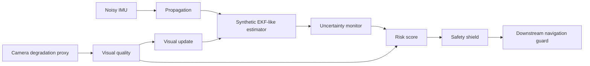
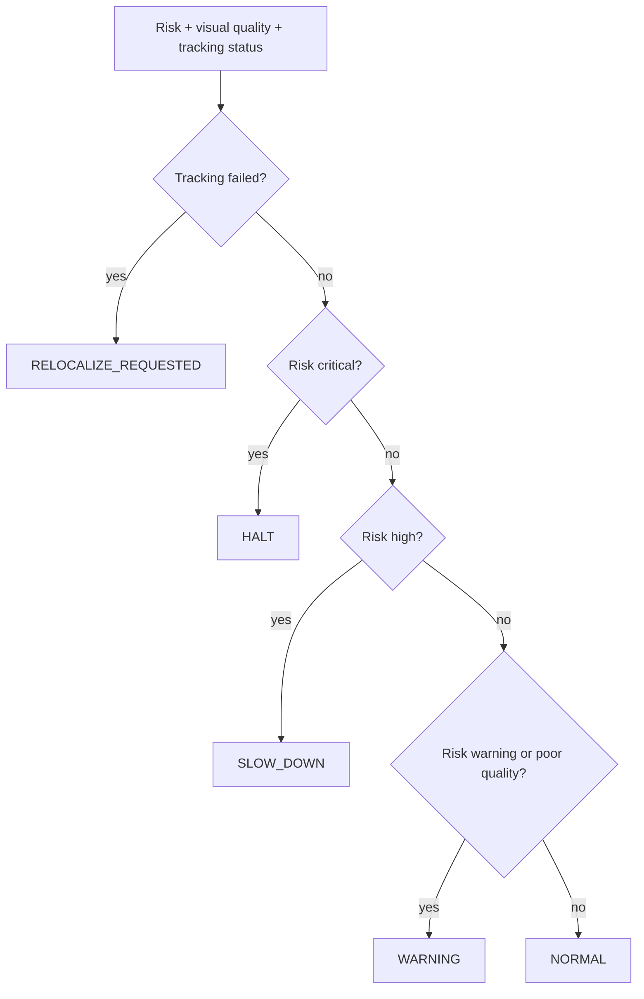

# SHIELD-VIO: Safety-Aware Visual-Inertial Odometry

[](https://github.com/panagiotagrosdouli/SHIELD-VIO/actions)


**SHIELD-VIO studies how a Visual-Inertial Odometry system can detect unreliable state estimates and shield downstream navigation from unsafe perception failures.**

> Research question: **How can a VIO system detect when its state estimate becomes unreliable and shield downstream navigation from unsafe perception failures?**

This repository is intentionally conservative: it does **not** claim state-of-the-art performance, does **not** invent benchmark numbers, and separates implemented code, prototypes, and planned work.

<p align="center"></p>

## Synthetic Demo first

The most important executable path is now:

```bash
python scripts/run_all.py
```

It runs the deterministic **Synthetic Demo** end to end:

1. synthetic trajectory and IMU/visual measurements,
2. EKF-like propagation and visual updates,
3. uncertainty, NEES/NIS, visual-quality, and risk scoring,
4. safety shield decisions,
5. metrics,
6. publication-style figures,
7. `demo.gif`, and
8. `demo.mp4` when `ffmpeg` is available.

Generated outputs are written to:

```text
results/synthetic_demo/ground_truth.csv
results/synthetic_demo/estimated_trajectory.csv
results/synthetic_demo/uncertainty.csv
results/synthetic_demo/visual_quality.csv
results/synthetic_demo/risk_score.csv
results/synthetic_demo/shield_events.csv
results/metrics/summary.json
results/metrics/metrics.csv
results/figures/*.png
assets/figures/*.png
assets/gifs/demo.gif
assets/videos/demo.mp4
results/videos/shield_vio_demo.gif
results/videos/shield_vio_demo.mp4
```

All generated numbers and videos are labeled **Synthetic Demo**. They are not real-world benchmark results.

## Motivation

Accurate pose estimation alone is not enough for safe autonomy. A downstream planner can behave unsafely when it receives a confident-looking but degraded VIO pose. SHIELD-VIO adds introspection: visual tracking quality, IMU consistency, covariance health, innovation consistency, normalized risk, and a safety shield that can request low-confidence mode, slow-down, halt, or relocalization.

## Scientific formulation

The nominal IMU-centric state is

```math
x = \{p_{WI}, v_{WI}, q_{WI}, b_a, b_g\}
```

with error state

```math
\delta x = [\delta p, \delta v, \delta\theta, \delta b_a, \delta b_g]^T \in \mathbb{R}^{15}.
```

The current executable demo uses a simplified 3D translational EKF-like synthetic estimator and clearly marks full production VIO as planned. It propagates state and covariance with noisy IMU acceleration, applies linear visual position updates, computes covariance trace/log-det, NEES, NIS, visual quality, normalized risk, and shield decisions. See [`docs/MATHEMATICAL_FORMULATION.md`](docs/MATHEMATICAL_FORMULATION.md) and [`docs/SYNTHETIC_DEMO_AUDIT.md`](docs/SYNTHETIC_DEMO_AUDIT.md).

## Architecture



## Commands

```bash
python -m pip install -e '.[dev]'
python scripts/run_synthetic_demo.py --out results/synthetic_demo --seed 7
python scripts/evaluate_experiment.py --results results/synthetic_demo
python scripts/generate_figures.py --results results/synthetic_demo
python scripts/make_demo_gif.py --results results/synthetic_demo
python scripts/run_all.py
pytest -q
```

## Docker quick start

```bash
docker build -t shield-vio .
docker run --rm -v "$PWD/results:/app/results" shield-vio python scripts/run_all.py
```

## Safety shield states



## Implemented / Prototype / Planned

| Area | Status | Evidence |
|---|---:|---|
| Deterministic synthetic VIO scenario | Implemented | `shield_vio/simulation/synthetic_vio.py` |
| Required CSV outputs | Implemented | `results/synthetic_demo/*.csv` generated by code |
| ATE/RPE synthetic metrics | Implemented | `scripts/evaluate_experiment.py` |
| Figure generation from code | Implemented | `scripts/generate_figures.py` |
| GIF and MP4 rendering from code | Implemented | `scripts/make_demo_gif.py` |
| End-to-end pipeline | Implemented | `scripts/run_all.py` |
| Regression tests | Implemented | `tests/test_synthetic_demo_pipeline.py` |
| Full production VIO backend | Planned | Real feature tracking, preintegration, loop closure, datasets |
| Real EuRoC/TUM-VI/KITTI benchmarks | Planned | Pending reproducible dataset integration |
| ROS2 closed-loop safety validation | Planned | Pending hardware/simulator integration |

## Metrics

The synthetic demo reports ATE RMSE, RPE RMSE, final position error, covariance trace, log determinant, entropy proxy, NEES, NIS, visual quality, risk score, shield activation rate, failure-detection precision/recall against synthetic degradation labels, and shield status counts.

## Limitations

This is not a production VIO backend. The executable demo is a deterministic research scaffold for uncertainty monitoring and safety-shield behavior. Real visual features, camera calibration, IMU preintegration, robust outlier rejection, map management, real datasets, hardware validation, and closed-loop navigation experiments remain planned.

## Citation

```bibtex
@misc{grosdouli2026shieldvio,
  title  = {SHIELD-VIO: Safety-Aware Visual-Inertial Odometry with Uncertainty Monitoring and Failure Shielding},
  author = {Grosdouli, Panagiota},
  year   = {2026},
  note   = {Research prototype; synthetic demo; no state-of-the-art claim},
  url    = {https://github.com/panagiotagrosdouli/SHIELD-VIO}
}
```

## Future MSc/PhD extensions

Conformal failure prediction, uncertainty calibration, shield-aware MPC, active perception recovery, robust visual-inertial preintegration, ROS2/hardware validation, and time-to-detection evaluation under safety-critical navigation constraints.
